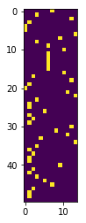
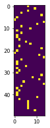
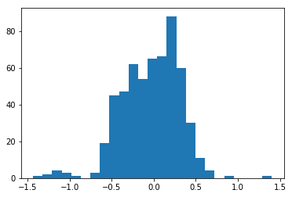
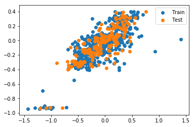
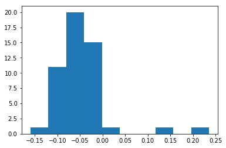

# SMILES enumeration, vectorization and batch generation

[](https://www.wildcardconsulting.dk/useful-information/smiles-enumeration-as-data-augmentation-for-molecular-neural-networks/)

SMILES enumeration is the process of writing out all possible SMILES forms of a molecule. It's a useful technique for data augmentation before sequence based modeling of molecules. You can read more about the background in this [blog post](https://www.wildcardconsulting.dk/useful-information/smiles-enumeration-as-data-augmentation-for-molecular-neural-networks/) or [this preprint on arxiv.org](https://arxiv.org/abs/1703.07076)

Import the SmilesEnumerator and instantiate the object


```python
from SmilesEnumerator import SmilesEnumerator
sme = SmilesEnumerator()
print help(SmilesEnumerator)
```

    Help on class SmilesEnumerator in module SmilesEnumerator:
    
    class SmilesEnumerator(__builtin__.object)
     |  SMILES Enumerator, vectorizer and devectorizer
     |  
     |  #Arguments
     |      charset: string containing the characters for the vectorization
     |        can also be generated via the .fit() method
     |      pad: Length of the vectorization
     |      leftpad: Add spaces to the left of the SMILES
     |      isomericSmiles: Generate SMILES containing information about stereogenic centers
     |      enum: Enumerate the SMILES during transform
     |      canonical: use canonical SMILES during transform (overrides enum)
     |  
     |  Methods defined here:
     |  
     |  __init__(self, charset=r'@C)(=cOn1S2/H[N]\', pad=120, leftpad=True, isomericSmiles=True, enum=True, canonical=False)
     |  
     |  fit(self, smiles, extra_chars=[], extra_pad=5)
     |      Performs extraction of the charset and length of a SMILES datasets and sets self.pad and self.charset
     |      
     |      #Arguments
     |          smiles: Numpy array or Pandas series containing smiles as strings
     |          extra_chars: List of extra chars to add to the charset (e.g. "\\" when "/" is present)
     |          extra_pad: Extra padding to add before or after the SMILES vectorization
     |  
     |  randomize_smiles(self, smiles)
     |      Perform a randomization of a SMILES string
     |      must be RDKit sanitizable
     |  
     |  reverse_transform(self, vect)
     |      Performs a conversion of a vectorized SMILES to a smiles strings
     |      charset must be the same as used for vectorization.
     |      #Arguments
     |          vect: Numpy array of vectorized SMILES.
     |  
     |  transform(self, smiles)
     |      Perform an enumeration (randomization) and vectorization of a Numpy array of smiles strings
     |      #Arguments
     |          smiles: Numpy array or Pandas series containing smiles as strings
     |  
     |  ----------------------------------------------------------------------
     |  Data descriptors defined here:
     |  
     |  __dict__
     |      dictionary for instance variables (if defined)
     |  
     |  __weakref__
     |      list of weak references to the object (if defined)
     |  
     |  charset
    
    None


A few SMILES strings will be enumerated as a demonstration.


```python
for i in range(10):
    print sme.randomize_smiles("CCC(=O)O[C@@]1(CC[NH+](C[C@H]1CC=C)C)c2ccccc2")
```

    c1([C@@]2(OC(=O)CC)CC[NH+](C)C[C@H]2CC=C)ccccc1
    c1ccc([C@]2(OC(=O)CC)[C@H](CC=C)C[NH+](C)CC2)cc1
    c1ccccc1[C@@]1(OC(CC)=O)CC[NH+](C)C[C@H]1CC=C
    O=C(CC)O[C@]1(c2ccccc2)CC[NH+](C)C[C@H]1CC=C
    C[NH+]1CC[C@](OC(=O)CC)(c2ccccc2)[C@H](CC=C)C1
    C1[C@@](c2ccccc2)(OC(CC)=O)[C@H](CC=C)C[NH+](C)C1
    [C@]1(c2ccccc2)(OC(=O)CC)CC[NH+](C)C[C@H]1CC=C
    c1([C@@]2(OC(CC)=O)CC[NH+](C)C[C@H]2CC=C)ccccc1
    [C@@H]1(CC=C)C[NH+](C)CC[C@]1(OC(=O)CC)c1ccccc1
    c1cccc([C@@]2(OC(=O)CC)CC[NH+](C)C[C@H]2CC=C)c1


## Vectorization

Before vectorization SMILES must be stored as strings in an numpy array. The transform takes numpy arrays or pandas series with the SMILES as strings.


```python
import numpy as np
smiles = np.array(["CCC(=O)O[C@@]1(CC[NH+](C[C@H]1CC=C)C)c2ccccc2"])
print smiles.shape
```

    (1,)


Fit the charset and the padding to the SMILES array, alternatively they can be specified when instantiating the object.


```python
sme.fit(smiles)
print sme.charset
print sme.pad
```

    @C)(+=cON12H[]
    50


There have been added some extra padding to the maximum lenght observed in the smiles array. The SMILES can be transformed to one-hot encoded vectors and showed with matplotlib.


```python
import matplotlib.pyplot as plt
%matplotlib inline
vect = sme.transform(smiles)
plt.imshow(vect[0])
```


    <matplotlib.image.AxesImage at 0x7f81d8742410>





It's a nice piano roll. If the vectorization is repeated, the vectorization will be different due to the enumeration, as sme.enum and sme.canonical is set to True and False, respectively (default settings).


```python
print sme.enumerate, sme.canonical
vect = sme.transform(smiles)
plt.imshow(vect[0])
```

    True False


    <matplotlib.image.AxesImage at 0x7f81d86e0710>





The reverse_transform() function can be used to translate back to a SMILES string, as long as the charset is the same as was used to vectorize.


```python
print sme.reverse_transform(vect)
```

    ['C(C[C@@H]1C[NH+](C)CC[C@@]1(c1ccccc1)OC(CC)=O)=C']


## Batch generation for Keras RNN modeling

The SmilesEnumerator class can be used together with the SmilesIterator batch generator for on the fly vectorization for RNN modeling of molecules. Below it's briefly demonstrated how this can be done.


```python
import pandas as pd

data = pd.read_csv("Example_data/Sutherland_DHFR.csv")
print data.head()
```

       Unnamed: 0                                      smiles_parent PC_uM_sign  \
    0           0                      CCc1nc(N)nc(N)c1-c1ccc(Cl)cc1        NaN   
    1           1                  CCc1nc(N)nc(N)c1-c1ccc(Cl)c(Cl)c1        NaN   
    2           2                   Cc1nc(N)nc(N)c1-c1ccc(Cl)c(Cl)c1        NaN   
    3           3                CCOCc1nc(N)nc(N)c1-c1ccc(Cl)c(Cl)c1        NaN   
    4           4  Nc1nc(N)c(-c2ccc(Cl)cc2)c(COc2ccc([N+](=O)[O-]...        NaN   
    
       PC_uM_value  
    0         3.70  
    1         1.08  
    2         1.68  
    3        12.70  
    4        85.10  


```python
from sklearn.cross_validation import train_test_split

#We ignore the > signs, and use random splitting for simplicity
X_train,  X_test, y_train, y_test = train_test_split(data["smiles_parent"],
                                                     np.log(data["PC_uM_value"]).values.reshape(-1,1),
                                                     random_state=42)

from sklearn.preprocessing import RobustScaler
rbs = RobustScaler(with_centering=True, with_scaling=True, quantile_range=(5.0, 95.0), copy=True)
y_train = rbs.fit_transform((y_train))
y_test = rbs.transform(y_test)
_ = plt.hist(y_train, bins=25)
```





```python
import keras.backend as K
from SmilesEnumerator import SmilesIterator
#The SmilesEnumerator must be fit to the entire dataset, so that all chars are registered
sme.fit(data["smiles_parent"])
sme.leftpad = True
print sme.charset
print sme.pad
#The dtype is set for the K.floatx(), which is the numerical type configured for Tensorflow or Theano
generator = SmilesIterator(X_train, y_train, sme, batch_size=200, dtype=K.floatx())
```

    Using TensorFlow backend.


    CBFIHcONS[r]#)(+-lon1s3254=
    75


```python
X,y = generator.next()
print X.shape
print y.shape
```

    (200, 75, 27)
    (200, 1)


Build a SMILES based RNN QSAR model with Keras.


```python
from keras.models import Sequential
from keras.layers import Dense, LSTM
from keras.layers.core import Dropout
from keras.callbacks import ReduceLROnPlateau
from keras import regularizers
from keras.optimizers import RMSprop, Adam
```


```python
input_shape = X.shape[1:]
output_shape = 1

model = Sequential()
model.add(LSTM(64,
               input_shape=input_shape,
               dropout = 0.19
               #unroll= True
              ))
model.add(Dense(output_shape,
                kernel_regularizer=regularizers.l1_l2(0.005,0.01),
                activation="linear"))

model.compile(loss="mse", optimizer=RMSprop(lr=0.005))
print model.summary()
```

    _________________________________________________________________
    Layer (type)                 Output Shape              Param #   
    =================================================================
    lstm_23 (LSTM)               (None, 64)                23552     
    _________________________________________________________________
    dense_23 (Dense)             (None, 1)                 65        
    =================================================================
    Total params: 23,617
    Trainable params: 23,617
    Non-trainable params: 0
    _________________________________________________________________
    None


Use the generator object for training.


```python
model.fit_generator(generator, steps_per_epoch=100, epochs=25, workers=4)
```

    Epoch 1/25
    100/100 [==============================] - 20s 203ms/step - loss: 0.15431s - loss
    Epoch 2/25
    100/100 [==============================] - 16s 156ms/step - loss: 0.1090
    Epoch 3/25
    100/100 [==============================] - 16s 156ms/step - loss: 0.09302s - loss: - ETA: 1s - l
    Epoch 4/25
    100/100 [==============================] - 16s 159ms/step - loss: 0.0830
    Epoch 5/25
    100/100 [==============================] - 16s 157ms/step - loss: 0.0773
    Epoch 6/25
    100/100 [==============================] - 15s 155ms/step - loss: 0.07310s - loss: 0.07
    Epoch 7/25
    100/100 [==============================] - 16s 155ms/step - loss: 0.0698
    Epoch 8/25
    100/100 [==============================] - 16s 156ms/step - loss: 0.0679
    Epoch 9/25
    100/100 [==============================] - 15s 155ms/step - loss: 0.0676
    Epoch 10/25
    100/100 [==============================] - 15s 155ms/step - loss: 0.0635
    Epoch 11/25
    100/100 [==============================] - 16s 156ms/step - loss: 0.06191s - loss: 0.062 - ETA: 1s - los
    Epoch 12/25
    100/100 [==============================] - 16s 156ms/step - loss: 0.06072 - ETA: 0s - loss: 0.060
    Epoch 13/25
    100/100 [==============================] - ETA: 0s - loss: 0.059 - 16s 156ms/step - loss: 0.0589
    Epoch 14/25
    100/100 [==============================] - 16s 156ms/step - loss: 0.0576
    Epoch 15/25
    100/100 [==============================] - 16s 157ms/step - loss: 0.0562
    Epoch 16/25
    100/100 [==============================] - 16s 156ms/step - loss: 0.0545
    Epoch 17/25
    100/100 [==============================] - 16s 155ms/step - loss: 0.0533
    Epoch 18/25
    100/100 [==============================] - 16s 156ms/step - loss: 0.0516
    Epoch 19/25
    100/100 [==============================] - 16s 157ms/step - loss: 0.049911s  - E - ET
    Epoch 20/25
    100/100 [==============================] - 16s 157ms/step - loss: 0.04951s - lo
    Epoch 21/25
    100/100 [==============================] - 16s 156ms/step - loss: 0.0475
    Epoch 22/25
    100/100 [==============================] - 16s 155ms/step - loss: 0.04595s - ETA: 3s - ETA: 0s - loss: 0.046 - ETA: 0s - loss: 0.
    Epoch 23/25
    100/100 [==============================] - 16s 155ms/step - loss: 0.0444
    Epoch 24/25
    100/100 [==============================] - 16s 158ms/step - loss: 0.0433
    Epoch 25/25
    100/100 [==============================] - 16s 157ms/step - loss: 0.0421


    <keras.callbacks.History at 0x7f6925d5ff10>


```python
y_pred_train = model.predict(sme.transform(X_train))
y_pred_test = model.predict(sme.transform(X_test))
plt.scatter(y_train, y_pred_train, label="Train")
plt.scatter(y_test, y_pred_test, label="Test")
plt.legend()
```


    <matplotlib.legend.Legend at 0x7f691c604990>





Not the best model until now. However, prolonged training with lowering of the learning rate towards the end will improve the model.


```python
#The Enumerator can be used in sampling
i = 1

y_true = y_test[i]
y_pred = model.predict(sme.transform(X_test.iloc[i:i+1]))
print y_true - y_pred
```

    [[-0.38300244]]


```python
#Enumeration of the SMILES before sampling stabilises the result
smiles_repeat = np.array([X_test.iloc[i:i+1].values[0]]*50)
y_pred = model.predict(sme.transform(smiles_repeat))
print y_pred.std()
print y_true - np.median(y_pred)
_ = plt.hist(y_pred)
```

    0.0616476
    [-0.10707214]





## Bibliography

Please cite: [SMILES enumeration as Data Augmentation for Network Modeling of Molecules](https://arxiv.org/abs/1703.07076)

```bibtex
@article{DBLP:journals/corr/Bjerrum17,
  author    = {Esben Jannik Bjerrum},
  title     = {{SMILES} Enumeration as Data Augmentation for Neural Network Modeling
               of Molecules},
  journal   = {CoRR},
  volume    = {abs/1703.07076},
  year      = {2017},
  url       = {http://arxiv.org/abs/1703.07076},
  timestamp = {Wed, 07 Jun 2017 14:40:38 +0200},
  biburl    = {http://dblp.uni-trier.de/rec/bib/journals/corr/Bjerrum17},
  bibsource = {dblp computer science bibliography, http://dblp.org}
}
```


If you find it useful, feel welcome to leave a comment on the [blog.](https://www.wildcardconsulting.dk/useful-information/smiles-enumeration-as-data-augmentation-for-molecular-neural-networks/) 
