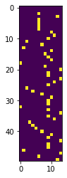

<div class="cell markdown">

# SMILES enumeration, vectorization and batch generation

[](https://www.wildcardconsulting.dk/useful-information/smiles-enumeration-as-data-augmentation-for-molecular-neural-networks/)

</div>

<div class="cell markdown">

SMILES enumeration is the process of writing out all possible SMILES
forms of a molecule. It's a useful technique for data augmentation
before sequence based modeling of molecules. You can read more about the
background in this [blog
post](https://www.wildcardconsulting.dk/useful-information/smiles-enumeration-as-data-augmentation-for-molecular-neural-networks/)
or [this preprint on arxiv.org](https://arxiv.org/abs/1703.07076)

</div>

<div class="cell markdown">

Import the SmilesEnumerator and instantiate the object

</div>

<div class="cell code" execution_count="1">

``` python
from SmilesEnumerator import SmilesEnumerator
sme = SmilesEnumerator()
print(help(SmilesEnumerator))
```

<div class="output stream stdout">

    Help on class SmilesEnumerator in module SmilesEnumerator:

    class SmilesEnumerator(builtins.object)
     |  SmilesEnumerator(charset='@C)(=cOn1S2/H[N]\\', pad=120, leftpad=True, isomericSmiles=True, enum=True, canonical=False)
     |  
     |  SMILES Enumerator, vectorizer and devectorizer
     |  
     |  #Arguments
     |      charset: string containing the characters for the vectorization
     |        can also be generated via the .fit() method
     |      pad: Length of the vectorization
     |      leftpad: Add spaces to the left of the SMILES
     |      isomericSmiles: Generate SMILES containing information about stereogenic centers
     |      enum: Enumerate the SMILES during transform
     |      canonical: use canonical SMILES during transform (overrides enum)
     |  
     |  Methods defined here:
     |  
     |  __init__(self, charset='@C)(=cOn1S2/H[N]\\', pad=120, leftpad=True, isomericSmiles=True, enum=True, canonical=False)
     |      Initialize self.  See help(type(self)) for accurate signature.
     |  
     |  fit(self, smiles, extra_chars=[], extra_pad=5)
     |      Performs extraction of the charset and length of a SMILES datasets and sets self.pad and self.charset
     |      
     |      #Arguments
     |          smiles: Numpy array or Pandas series containing smiles as strings
     |          extra_chars: List of extra chars to add to the charset (e.g. "\\" when "/" is present)
     |          extra_pad: Extra padding to add before or after the SMILES vectorization
     |  
     |  randomize_smiles(self, smiles)
     |      Perform a randomization of a SMILES string
     |      must be RDKit sanitizable
     |  
     |  reverse_transform(self, vect)
     |      Performs a conversion of a vectorized SMILES to a smiles strings
     |      charset must be the same as used for vectorization.
     |      #Arguments
     |          vect: Numpy array of vectorized SMILES.
     |  
     |  transform(self, smiles)
     |      Perform an enumeration (randomization) and vectorization of a Numpy array of smiles strings
     |      #Arguments
     |          smiles: Numpy array or Pandas series containing smiles as strings
     |  
     |  ----------------------------------------------------------------------
     |  Data descriptors defined here:
     |  
     |  __dict__
     |      dictionary for instance variables (if defined)
     |  
     |  __weakref__
     |      list of weak references to the object (if defined)
     |  
     |  charset

    None

</div>

</div>

<div class="cell markdown">

A few SMILES strings will be enumerated as a demonstration.

</div>

<div class="cell code" execution_count="2">

``` python
for i in range(10):
    print(sme.randomize_smiles("CCC(=O)O[C@@]1(CC[NH+](C[C@H]1CC=C)C)c2ccccc2"))
```

<div class="output stream stdout">

    c1cccc([C@@]2(OC(CC)=O)CC[NH+](C)C[C@H]2CC=C)c1
    C([C@H]1[C@@](OC(CC)=O)(c2ccccc2)CC[NH+](C)C1)C=C
    c1ccc([C@]2(OC(=O)CC)[C@H](CC=C)C[NH+](C)CC2)cc1
    c1cccc([C@@]2(OC(=O)CC)CC[NH+](C)C[C@H]2CC=C)c1
    C(=O)(CC)O[C@]1(c2ccccc2)CC[NH+](C)C[C@H]1CC=C
    C(C)C(O[C@@]1(c2ccccc2)[C@H](CC=C)C[NH+](C)CC1)=O
    C1[NH+](C)C[C@@H](CC=C)[C@@](OC(CC)=O)(c2ccccc2)C1
    C(C)C(=O)O[C@@]1(c2ccccc2)[C@H](CC=C)C[NH+](C)CC1
    CCC(O[C@]1(c2ccccc2)CC[NH+](C)C[C@H]1CC=C)=O
    C(C(O[C@]1(c2ccccc2)CC[NH+](C)C[C@H]1CC=C)=O)C

</div>

</div>

<div class="cell markdown">

## Vectorization

</div>

<div class="cell markdown">

Before vectorization SMILES must be stored as strings in an numpy array.
The transform takes numpy arrays or pandas series with the SMILES as
strings.

</div>

<div class="cell code" execution_count="3" scrolled="true">

``` python
import numpy as np
smiles = np.array(["CCC(=O)O[C@@]1(CC[NH+](C[C@H]1CC=C)C)c2ccccc2"])
print(smiles.shape)
```

<div class="output stream stdout">

    (1,)

</div>

</div>

<div class="cell markdown">

Fit the charset and the padding to the SMILES array, alternatively they
can be specified when instantiating the object.

</div>

<div class="cell code" execution_count="4">

``` python
sme.fit(smiles)
print(sme.charset)
print(sme.pad)
```

<div class="output stream stdout">

    =2@NH+c]OC([1)
    50

</div>

</div>

<div class="cell markdown">

There have been added some extra padding to the maximum lenght observed
in the smiles array. The SMILES can be transformed to one-hot encoded
vectors and showed with matplotlib.

</div>

<div class="cell code" execution_count="5">

``` python
import matplotlib.pyplot as plt
%matplotlib inline
vect = sme.transform(smiles)
plt.imshow(vect[0])
```

<div class="output execute_result" execution_count="5">

    <matplotlib.image.AxesImage at 0x7f9cbde54d30>

</div>

<div class="output display_data">



</div>

</div>

<div class="cell markdown">

It's a nice piano roll. If the vectorization is repeated, the
vectorization will be different due to the enumeration, as sme.enum and
sme.canonical is set to True and False, respectively (default settings).

</div>

<div class="cell code" execution_count="7">

``` python
print(sme.enumerate, sme.canonical)
vect = sme.transform(smiles)
plt.imshow(vect[0])
```

<div class="output stream stdout">

    True False

</div>

<div class="output execute_result" execution_count="7">

    <matplotlib.image.AxesImage at 0x7f9cb5d544c0>

</div>

<div class="output display_data">


</div>

</div>

<div class="cell markdown">

The reverse_transform() function can be used to translate back to a
SMILES string, as long as the charset is the same as was used to
vectorize.

</div>

<div class="cell code" execution_count="8">

``` python
print(sme.reverse_transform(vect))
```

<div class="output stream stdout">

    ['CCC(=O)O[C@@]1(c2ccccc2)[C@H](CC=C)C[NH+](C)CC1']

</div>

</div>

<div class="cell markdown">

## Batch generation for Keras RNN modeling

</div>

<div class="cell markdown">

The SmilesEnumerator class can be used together with the SmilesIterator
batch generator for on the fly vectorization for RNN modeling of
molecules. Below it's briefly demonstrated how this can be done.

</div>

<div class="cell code" execution_count="9">

``` python
import pandas as pd

data = pd.read_csv("Example_data/Sutherland_DHFR.csv")
print(data.head())
```

<div class="output stream stdout">

       Unnamed: 0                                      smiles_parent PC_uM_sign  \
    0           0                      CCc1nc(N)nc(N)c1-c1ccc(Cl)cc1        NaN   
    1           1                  CCc1nc(N)nc(N)c1-c1ccc(Cl)c(Cl)c1        NaN   
    2           2                   Cc1nc(N)nc(N)c1-c1ccc(Cl)c(Cl)c1        NaN   
    3           3                CCOCc1nc(N)nc(N)c1-c1ccc(Cl)c(Cl)c1        NaN   
    4           4  Nc1nc(N)c(-c2ccc(Cl)cc2)c(COc2ccc([N+](=O)[O-]...        NaN   

       PC_uM_value  
    0         3.70  
    1         1.08  
    2         1.68  
    3        12.70  
    4        85.10  

</div>

</div>

<div class="cell code" execution_count="11">

``` python
from sklearn.model_selection import train_test_split

#We ignore the > signs, and use random splitting for simplicity
X_train,  X_test, y_train, y_test = train_test_split(data["smiles_parent"],
                                                     np.log(data["PC_uM_value"]).values.reshape(-1,1),
                                                     random_state=42)

from sklearn.preprocessing import RobustScaler
rbs = RobustScaler(with_centering=True, with_scaling=True, quantile_range=(5.0, 95.0), copy=True)
y_train = rbs.fit_transform((y_train))
y_test = rbs.transform(y_test)
_ = plt.hist(y_train, bins=25)
```

<div class="output display_data">


</div>

</div>

<div class="cell code" execution_count="16">

``` python
import tensorflow.keras.backend as K
from SmilesEnumerator import SmilesIterator
#The SmilesEnumerator must be fit to the entire dataset, so that all chars are registered
sme.fit(data["smiles_parent"])
sme.leftpad = True
print(sme.charset)
print(sme.pad)
#The dtype is set for the K.floatx(), which is the numerical type configured for Tensorflow or Theano
generator = SmilesIterator(X_train, y_train, sme, batch_size=200, dtype=K.floatx())
```

<div class="output stream stdout">

    3o4n+c-(l5N[s1F=SB2IH]#OrC)
    75

</div>

</div>

<div class="cell code" execution_count="18">

``` python
X,y = generator.next()
print(X.shape)
print(y.shape)
```

<div class="output stream stdout">

    (200, 75, 27)
    (200, 1)

</div>

</div>

<div class="cell markdown">

Build a SMILES based RNN QSAR model with Keras.

</div>

<div class="cell code" execution_count="25">

``` python
from tensorflow.keras.models import Sequential
from tensorflow.keras.layers import Dense, LSTM
from tensorflow.keras import regularizers
from tensorflow.keras.optimizers import RMSprop
```

</div>

<div class="cell code" execution_count="45">

``` python
input_shape = X.shape[1:]
output_shape = 1

model = Sequential()
model.add(LSTM(64,
               input_shape=input_shape,
               dropout = 0.19
               #unroll= True
              ))
model.add(Dense(output_shape,
                kernel_regularizer=regularizers.l1_l2(0.005,0.01),
                activation="linear"))

model.compile(loss="mse", optimizer=RMSprop(lr=0.005))
print(model.summary())
```

<div class="output stream stdout">

    Model: "sequential_4"
    _________________________________________________________________
     Layer (type)                Output Shape              Param #   
    =================================================================
     lstm_4 (LSTM)               (None, 64)                23552     
                                                                     
     dense_4 (Dense)             (None, 1)                 65        
                                                                     
    =================================================================
    Total params: 23,617
    Trainable params: 23,617
    Non-trainable params: 0
    _________________________________________________________________
    None

</div>

</div>

<div class="cell markdown">

Use the generator object for training.

</div>

<div class="cell code" execution_count="46">

``` python
model.fit_generator(generator, steps_per_epoch=100, epochs=25, workers=4)
```

<div class="output stream stderr">

    /tmp/ipykernel_1329301/2098089966.py:1: UserWarning: `Model.fit_generator` is deprecated and will be removed in a future version. Please use `Model.fit`, which supports generators.
      model.fit_generator(generator, steps_per_epoch=100, epochs=25, workers=4)

</div>

<div class="output stream stdout">

    Epoch 1/25
    100/100 [==============================] - 8s 67ms/step - loss: 0.1390
    Epoch 2/25
    100/100 [==============================] - 6s 62ms/step - loss: 0.1065
    Epoch 3/25
    100/100 [==============================] - 6s 62ms/step - loss: 0.0945
    Epoch 4/25
    100/100 [==============================] - 6s 62ms/step - loss: 0.0899
    Epoch 5/25
    100/100 [==============================] - 6s 63ms/step - loss: 0.0853
    Epoch 6/25
    100/100 [==============================] - 6s 61ms/step - loss: 0.0804
    Epoch 7/25
    100/100 [==============================] - 6s 62ms/step - loss: 0.0783
    Epoch 8/25
    100/100 [==============================] - 6s 63ms/step - loss: 0.0800
    Epoch 9/25
    100/100 [==============================] - 6s 62ms/step - loss: 0.0740
    Epoch 10/25
    100/100 [==============================] - 6s 61ms/step - loss: 0.0737
    Epoch 11/25
    100/100 [==============================] - 6s 62ms/step - loss: 0.0716
    Epoch 12/25
    100/100 [==============================] - 6s 60ms/step - loss: 0.0677
    Epoch 13/25
    100/100 [==============================] - 6s 62ms/step - loss: 0.0656
    Epoch 14/25
    100/100 [==============================] - 6s 61ms/step - loss: 0.0636
    Epoch 15/25
    100/100 [==============================] - 6s 62ms/step - loss: 0.0617
    Epoch 16/25
    100/100 [==============================] - 6s 62ms/step - loss: 0.0605
    Epoch 17/25
    100/100 [==============================] - 6s 61ms/step - loss: 0.0592
    Epoch 18/25
    100/100 [==============================] - 6s 63ms/step - loss: 0.0580
    Epoch 19/25
    100/100 [==============================] - 6s 61ms/step - loss: 0.0561
    Epoch 20/25
    100/100 [==============================] - 6s 63ms/step - loss: 0.0555
    Epoch 21/25
    100/100 [==============================] - 6s 61ms/step - loss: 0.0543
    Epoch 22/25
    100/100 [==============================] - 6s 62ms/step - loss: 0.0517
    Epoch 23/25
    100/100 [==============================] - 6s 61ms/step - loss: 0.0553
    Epoch 24/25
    100/100 [==============================] - 6s 60ms/step - loss: 0.0512
    Epoch 25/25
    100/100 [==============================] - 6s 63ms/step - loss: 0.0497

</div>

<div class="output execute_result" execution_count="46">

    <keras.callbacks.History at 0x7f9bdc1a30a0>

</div>

</div>

<div class="cell code" execution_count="47">

``` python
y_pred_train = model.predict(sme.transform(X_train))
y_pred_test = model.predict(sme.transform(X_test))
plt.scatter(y_train, y_pred_train, label="Train")
plt.scatter(y_test, y_pred_test, label="Test")
plt.legend()
```

<div class="output execute_result" execution_count="47">

    <matplotlib.legend.Legend at 0x7f9bb8162260>

</div>

<div class="output display_data">


</div>

</div>

<div class="cell markdown">

Not the best model until now. However, prolonged training with lowering
of the learning rate towards the end will improve the model.

</div>

<div class="cell code" execution_count="50">

``` python
#The Enumerator can be used in sampling
i = 0

y_true = y_test[i]
y_pred = model.predict(sme.transform(X_test.iloc[i:i+1]))
print(y_true)
print(y_true - y_pred)
```

<div class="output stream stdout">

    [0.23319628]
    [[0.11318717]]

</div>

</div>

<div class="cell code" execution_count="51">

``` python
#Enumeration of the SMILES before sampling stabilises the result
smiles_repeat = np.array([X_test.iloc[i:i+1].values[0]]*50)
y_pred = model.predict(sme.transform(smiles_repeat))
print(y_pred.std())
print(y_true - np.median(y_pred))
_ = plt.hist(y_pred)
```

<div class="output stream stdout">

    0.037997264
    [0.1770267]

</div>

<div class="output display_data">


</div>

</div>

<div class="cell markdown">

## Bibliography

Please cite: [SMILES enumeration as Data Augmentation for Network
Modeling of Molecules](https://arxiv.org/abs/1703.07076)

``` bibtex
@article{DBLP:journals/corr/Bjerrum17,
  author    = {Esben Jannik Bjerrum},
  title     = {{SMILES} Enumeration as Data Augmentation for Neural Network Modeling
               of Molecules},
  journal   = {CoRR},
  volume    = {abs/1703.07076},
  year      = {2017},
  url       = {http://arxiv.org/abs/1703.07076},
  timestamp = {Wed, 07 Jun 2017 14:40:38 +0200},
  biburl    = {http://dblp.uni-trier.de/rec/bib/journals/corr/Bjerrum17},
  bibsource = {dblp computer science bibliography, http://dblp.org}
}
```

</div>

<div class="cell markdown">

If you find it useful, feel welcome to leave a comment on the
[blog.](https://www.wildcardconsulting.dk/useful-information/smiles-enumeration-as-data-augmentation-for-molecular-neural-networks/)

</div>

<div class="cell code">

``` python
```

</div>
